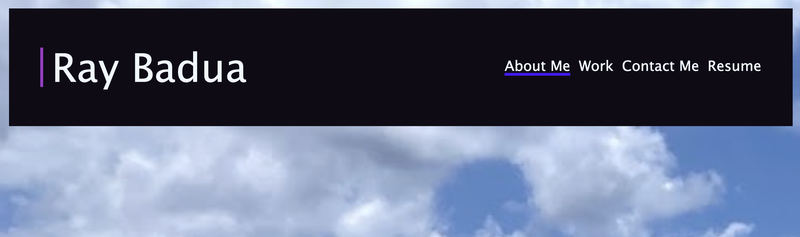
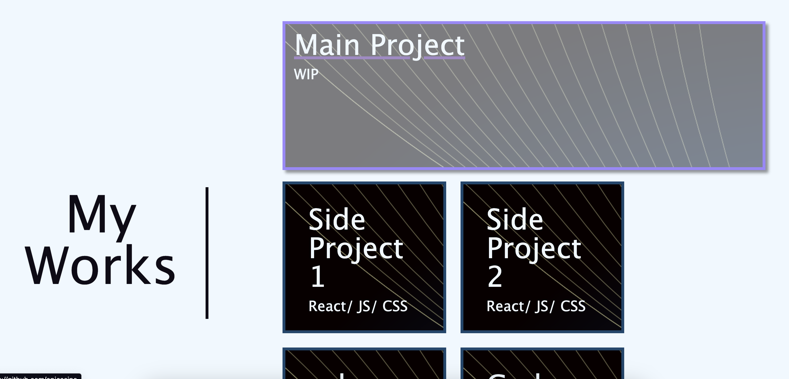
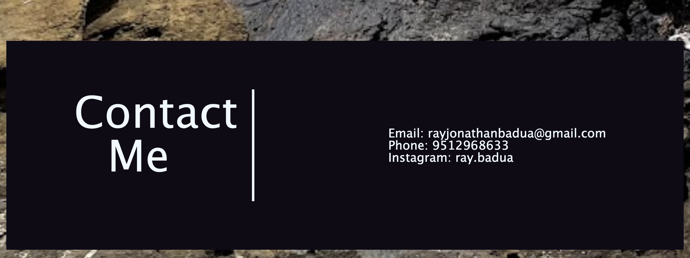

# FirstPortfolio (UCSD Challenge 2)

## Description

Provide a short description explaining the what, why, and how of your project. Use the following questions as a guide:

- I made a portfolio page from scratch using HTML & CSS. 
- I wanted a webpage to showcase my projects and my own UI/UX skills.
- I can now use this webpage as a way for future employers to see my programming prowess. 
- This portfolio has taught me flexbox and building mobile-friendly webpages from scratch.

## Installation

- Live deployment in GitPages. No installation is needed to see the portfolio.

## Usage

- When accessing the GitPages deployment, you will be presented with a navbar. Hovering over the different "tabs" will underline the text, and clicking on it will scroll you down to the appropiate section.
- Alternatively, clicking on the 'Resume' text will redirect you to my LinkedIn page.

- Going to the 'works' section, the main project will be bigger than the other projects below. Hovering over the project text will change the project box's color & apply a box shadow to it. Only the main project, and side project 3 & 4 boxes contain links.

- At the 'contact me' section, each form of contact is linked accordingly for ease of communication.

## Credits

- One major guide that helped me with CSS flexbox is CSS tricks' guide on it!
https://css-tricks.com/snippets/css/a-guide-to-flexbox/

## License

MIT License

Copyright (c) 2023 Ray Badua

Permission is hereby granted, free of charge, to any person obtaining a copy
of this software and associated documentation files (the "Software"), to deal
in the Software without restriction, including without limitation the rights
to use, copy, modify, merge, publish, distribute, sublicense, and/or sell
copies of the Software, and to permit persons to whom the Software is
furnished to do so, subject to the following conditions:

The above copyright notice and this permission notice shall be included in all
copies or substantial portions of the Software.

THE SOFTWARE IS PROVIDED "AS IS", WITHOUT WARRANTY OF ANY KIND, EXPRESS OR
IMPLIED, INCLUDING BUT NOT LIMITED TO THE WARRANTIES OF MERCHANTABILITY,
FITNESS FOR A PARTICULAR PURPOSE AND NONINFRINGEMENT. IN NO EVENT SHALL THE
AUTHORS OR COPYRIGHT HOLDERS BE LIABLE FOR ANY CLAIM, DAMAGES OR OTHER
LIABILITY, WHETHER IN AN ACTION OF CONTRACT, TORT OR OTHERWISE, ARISING FROM,
OUT OF OR IN CONNECTION WITH THE SOFTWARE OR THE USE OR OTHER DEALINGS IN THE
SOFTWARE.